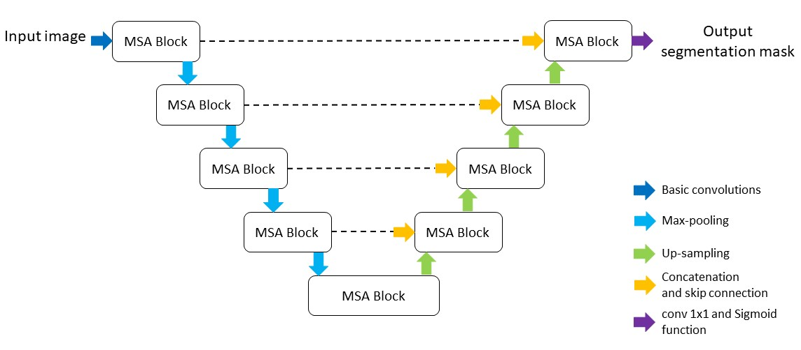

# An Automatic Nuclei Image Segmentation Based on Multi-Scale Split-Attention U-Net  
By [Qing Xu](https://www.linkedin.com/in/%E5%8D%BF-%E5%BE%90-6556a9181/), [Wenting Duan](https://staff.lincoln.ac.uk/wduan)

MICCAI COMPAY 2021 paper: [An Automatic Nuclei Image Segmentation Based on Multi-Scale Split-Attention U-Net ](https://proceedings.mlr.press/v156/xu21a.html)
## Architecture


## Requirements
1. pytorch >=1.5.0
2. pytorch-lightning==1.1.0
3. albumentations

## Dataset
A public microscopy image dataset from 2018 Data Science Bowl grand challenge:
>[https://www.kaggle.com/c/data-science-bowl-2018/data/](https://www.kaggle.com/c/data-science-bowl-2018/data)

## Train
You first need to download the public dataset or prepare your private dataset (with 2018 Data Science Bowl format). An example of training the model is: 
```
python train.py --dataset train_set --loss combined --batch 8 --lr 0.001 --epoch 200
```
## Evaluation
```
python eval.py --dataset test_set --model checkpoints/model_1.pth
```
## Visualisation
```
python predict.py --dataset test_set --model checkpoints/model_1.pth
```
## Citation
```
@InProceedings{pmlr-v156-xu21a,
  title = 	 {An Automatic Nuclei Image Segmentation Based on Multi-Scale Split-Attention U-Net},
  author =       {Xu, Qing and Duan, Wenting},
  booktitle = 	 {Proceedings of the MICCAI Workshop on Computational Pathology}, 
  pages = 	 {236--245},
  year = 	 {2021}
}
```
